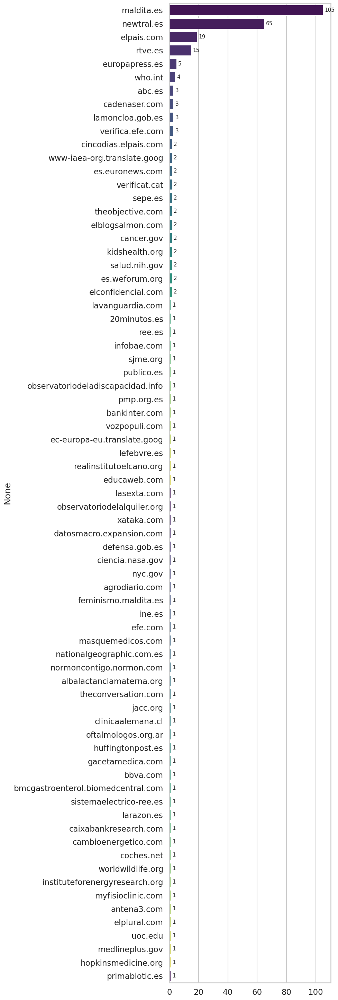
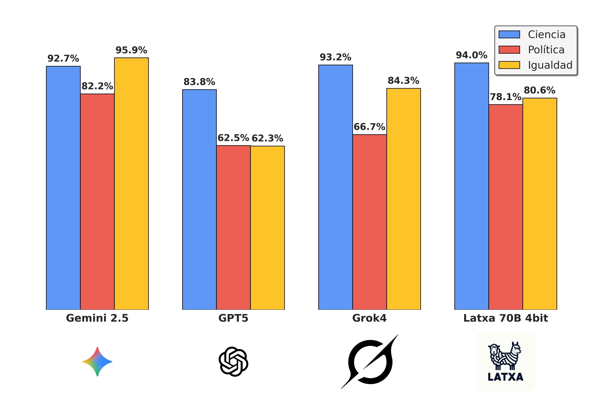

# Evaluation Results

We have evaluated the performance of the fact-checking system when different LLM backbones in the 🤗[Iker/FactCheckingEval](https://huggingface.co/datasets/Iker/FactCheckingEval) dataset. 

# The dataset

The dataset is a collection of expert human fact-checking articles, in which a statement has been proved to be true or false. The dataset is split into three categories: Politics (Spanish politics),  Equality (Feminism, LGTB+ and Inmigration) and Science (Science, technology and Health). For each category, there are 100 statements, 50 true and 50 false ones. Most of the statements in the dataset are about current events, compromissing news that happened around Agust 2025. All the statements and soruces are in Spanish. 

The dataset is structured as follows:
- id: Unique identifier for the statement
- statement: The statement to be fact-checked, this is a stement that has been proved to be true or false by a human expert in the article, and strong evidence is provided to support or refute it. It does not neccesarily have to be the main claim of the article. 
- label: True or False
- source_url: URL to the main text of the article. 
- source_name: Name of the source of the article
- language: The language of the statement
- domain_url: URL to the domain of the article

The main sources for the articles are:

# Evaluation procedure

We evaluated different LLM backbones by running the full fact-checking workflow on the 300 statements in the dataset. Each model was configured with RAG-based retrieval and the same web search settings. Source domains from the dataset were banned to prevent data leakage. This is, for every statement ALL the sources described in the table above were banned. This is, the model did not have acess to maldita.es, newtral.es, elpais.com, etc... 

For detailed instructions on running evaluations, see [run-evaluation.md](run-evaluation.md).

For detailed explanation of the pipeline, see [fact-checking-workflow-description.md](fact-checking-workflow-description.md).

# Results

**Gemini 2.5 Flash** achieved the best overall performance with 91.24% accuracy. **Latxa models** show surprisingly competitive results, particularly Latxa 70B 4-bit with 85.84% accuracy—demonstrating that open-source models can approach proprietary model performance. Notably, **4-bit quantization does not have a strong performance impact**: Latxa 8B 4-bit (75.98% accuracy) performs comparably to the full-precision Latxa 8B (74.72% accuracy).

The exact config to replicate the experiments are available in [configs/evaluator_configs/](../configs/evaluator_configs/).

| Model | RAG | Embedding | Accuracy | Precision | Recall | F1 Score | Undetermined Rate | Cost ($) |
|-------|-----|-----------|----------|-----------|--------|----------|-------------------|----------|
| Gemini 2.5 Flash | ✓ | gemini-embedding-001 | 91.24% | 94.50% | 86.55% | 90.35 | 16.33% | 9.68 |
| Gemini 2.5 Flash | ✗ | - | 90.73% | 92.92% | 87.50% | 90.13 | 17.33% | 11.67 |
| Latxa 70B 4-bit | ✓ | gemini-embedding-001 | 85.84% | 87.50% | 82.73% | 85.05 | 24.67% | 1.50 |
| Grok 4 | ✓ | gemini-embedding-001 | 83.92% | 91.96% | 73.57% | 81.75 | 4.67% | 7.78 |
| Latxa 4B VL | ✓ | gemini-embedding-001 | 84.79% | 81.82% | 90.00% | 85.71 | 27.67% | 1.50 |
| GPT5 | ✓ | text-embedding-3-large | 77.31% | 95.89% | 55.56% | 70.35 | 13.33% | 16.66 |
| Latxa 8B 4-bit | ✓ | gemini-embedding-001 | 75.98% | 80.77% | 67.20% | 73.36 | 15.33% | 1.50 |
| Latxa 8B 4-bit | ✓ | text-embedding-3-large | 77.65% | 85.44% | 67.69% | 75.54 | 15.00% | 2.29 |
| Latxa 8B | ✓ | gemini-embedding-001 | 74.72% | 80.95% | 63.91% | 71.43 | 10.33% | 1.50 |

*Cost computed as the total API cost of running the fact-checking workflow for 300 statements. Since we run Latxa in local-host setting, we consider the cost of running it 0$. 

Statements for which the system couldn't get enough information to classify into True or False are marked as "Undetermined".

## Results by Category (F1 Score)

| Model | RAG | Embedding | Science | Politics | Equality | Overall Acc. | Overall F1 |
|-------|-----|-----------|---------|----------|----------|--------------|------------|
| Gemini 2.5 Flash | ✓ | gemini-embedding-001 | 92.68 | 82.19 | 95.89 | 91.24% | 90.35 |
| Gemini 2.5 Flash | ✗ | - | 91.57 | 84.06 | 93.83 | 90.73% | 90.13 |
| Latxa 4B VL | ✓ | gemini-embedding-001 | 88.42 | 81.01 | 87.72 | 84.79% | 85.71 |
| Latxa 70B 4-bit | ✓ | gemini-embedding-001 | 93.98 | 78.12 | 80.60 | 85.84% | 85.05 |
| Grok 4 | ✓ | gemini-embedding-001 | 93.18 | 66.67 | 84.34 | 83.92% | 81.75 |
| Latxa 8B 4-bit | ✓ | text-embedding-3-large | 83.54 | 72.50 | 70.27 | 77.65% | 75.54 |
| Latxa 8B 4-bit | ✓ | gemini-embedding-001 | 81.40 | 61.11 | 76.06 | 75.98% | 73.36 |
| Latxa 8B | ✓ | gemini-embedding-001 | 79.55 | 64.94 | 68.49 | 74.72% | 71.43 |
| GPT5 | ✓ | text-embedding-3-large | 83.78 | 62.50 | 62.30 | 77.31% | 70.35 | 