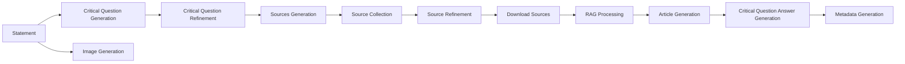

# Fact-Checking Workflow Documentation

This document describes the step-by-step fact-checking pipeline, explaining what each step does and the parameters available for customization.

---

## Quick Overview

The workflow processes a statement provided by the user through 11 main steps:



---


## Examples

We provide three different 📓Jupyter notebooks that demostrate how to use the fact-cheking software:
- 📓 `notebooks/run_workflow.ipynb`: Runs the full pipeline in a single call based on a workflow configuration file.
- 📓 `notebooks/test_stepwiseworkflow-local.ipynb`: Runs the workflow manually step-by step, this allows to see the output of each step and iterate over them if needed.
- 📓 `notebooks/test_stepwiseworkflow.ipynb`: Runs the workflow manually step-by step, using a locally hosted model (Latxa 8B).

---

## Pipeline Configuration

Pipeline configurations are YAML files that define which models and parameters to use for each step of the workflow. Configuration files are stored in `configs/pipeline_configs/`. This is neccesary if you want to run the pipeline in a single step as demostrated in `notebooks/run_workflow.ipynb` or if you want to use the evaluator.

### Available Configurations

| Config File | Description |
|-------------|-------------|
| `gemini_rag.yaml` | Uses Gemini models with RAG enabled |
| `gemini_full.yaml` | Uses Gemini models without RAG |
| `gpt_rag.yaml` | Uses GPT models with RAG enabled |
| `gpt_full.yaml` | Uses GPT models without RAG |
| `latxa8b_rag.yaml` | Uses local Latxa 8B model with RAG |
| `latxa70b_rag.yaml` | Uses local Latxa 70B model with RAG |

### Configuration Structure

```yaml
# Workflow type
workflow_type: "FactCheckingWithPipelineWorkflow"

# Model configuration - specify different models for each agent
models:
  critical_question_agent: "google/gemini-2.5-pro"    # Critical question generation
  gen_searches_agent: "google/gemini-2.5-flash"      # Search query generation
  web_search_provider: "serper"                       # Web search API provider
  embedding: "gemini-embedding-001"                   # Embedding model for RAG
  question_agent: "google/gemini-2.5-flash"          # Question answering
  article_writer: "google/gemini-2.5-flash"          # Article generation
  metadata_agent: "google/gemini-2.5-flash"          # Metadata extraction
  image_prompt: "google/gemini-2.5-flash"            # Image description
  image_model: "flux-replicate"                       # Image generation

# Web search configuration
web_search:
  top_k: 5                    # Results per query
  max_searches: 5             # Maximum search queries
  ban_domains: null           # Domains to exclude (or list of domains)
  download_text: true         # Download full page content

# RAG configuration
rag:
  do_rag: True                # Enable/disable RAG
  chunk_size: 128             # Characters per chunk
  chunk_overlap: 0            # Overlap between chunks
  split_separators: ["\n"]    # Text splitting separators
  fp16_storage: true          # Use float16 for memory efficiency
  l2_normalise: true          # L2-normalize embeddings
  top_k: 3                    # Passages to retrieve per query
  get_scores: false           # Include similarity scores

# Question generation
questions:
  max_questions: 5            # Maximum critical questions

# Image generation
image:
  size: "1280x256"            # Output image size
  style: "Digital art..."     # Style guidance for the image

# General settings
general:
  max_history_size: null      # History limit (null = unlimited)
```

---

## Project Structure

The fact-checking pipeline follows a modular, agent-based architecture. Each workflow step is implemented as an independent agent with well-defined inputs, outputs, and prompts.

### Agent Architecture

All agents are defined in `veridika/src/agents/` and inherit from a common `BaseAgent` class:

```
veridika/src/agents/
├── baseagent.py              # Base class with common functionality
├── CriticalQuestionAgent.py  # Steps 1-2: Question generation/refinement
├── GenSearchesAgent.py       # Steps 3, 5: Search query generation/refinement
├── WebSearchAgent.py         # Step 4: Web search execution (Serper)
├── RagAgent.py               # Step 7: Retrieval-Augmented Generation
├── ArticleWriterAgent.py     # Step 8: Fact-check article generation
├── QuestionAgent.py          # Step 9: Critical question answering
├── MetadataAgent.py          # Step 10: Metadata extraction
├── ImagePromptAgent.py       # Step 11a: Image description generation
└── ImageGenAgent.py          # Step 11b: Image generation (Flux)
```

### Key Features

#### Structured Outputs

Agents use **Pydantic models** to enforce structured JSON outputs from the LLM. This ensures consistent, parseable responses:

```python
from pydantic import BaseModel

class Metadata(BaseModel):
    title: str
    categories: list[str]
    label: Literal["Fake", "True", "Undetermined"]
    main_claim: str

# LLM returns validated structured output 
response, cost = self.model(messages=conversation, pydantic_model=Metadata)
```

#### Cost Tracking

Every agent call returns a cost value that is automatically tracked:

```python
# Each agent.run() returns: (result, cost, history_entry)
result, cost, history = agent.run(...)

# Access accumulated costs
print(agent.cost)           # Total cost
print(agent.get_stats())    # Detailed statistics
```

#### Execution History

Agents maintain a history of all operations for debugging and auditing:

```python
history = agent.get_history()
# Returns: [{"date": "...", "run_time": 1.23, "cost": 0.001, "history_entry": {...}}, ...]
```

#### Async Execution

Agents support asynchronous execution for parallel processing:

```python
# Agents can be called directly and awaited
result, cost = await agent(statement="...", langid="es")

# Or run multiple agents in parallel
results = await asyncio.gather(agent1(...), agent2(...))
```

### Agent Interface

Each agent implements the following pattern:

| Method | Description |
|--------|-------------|
| `__init__(model_name, ...)` | Initialize with model and configuration |
| `run(*args, **kwargs)` | Execute the agent's core logic |
| `get_history()` | Get execution history |
| `get_stats()` | Get performance statistics |
| `reset()` | Reset agent state and history |

---

# Fact Cheking Steps

## 1. Critical Question Generation

**Agent:** `CriticalQuestionAgent`

Generates critical research questions to guide the fact-checking investigation. These questions identify what information is needed to verify or refute the statement.

### Parameters

| Parameter | Type | Description |
|-----------|------|-------------|
| `statement` | `str` | The input statement to analyze and fact-check |
| `model` | `str` | LLM model name (e.g., `"google/gemini-2.5-flash"`) |
| `language` | `str` | Language code for output (e.g., `"es"`, `"en"`) |
| `location` | `str` | Location context for regional relevance (e.g., `"es"`) |

### Example

**Input:**
```python
statement = "Los coches eléctricos son más contaminantes que los coches de gasolina"
language = "es"
location = "es"
```

**Output:**
```json
{
    "questions": [
        "¿Cuáles son las emisiones de carbono promedio en la producción de un coche eléctrico (incluyendo la batería) en comparación con la producción de un coche de gasolina en 2025?",
        "¿Qué estudios de análisis de ciclo de vida (LCA) publicados entre 2020 y 2025 comparan el impacto ambiental total de los coches eléctricos y los coches de gasolina?",
        "¿Cuál es la huella de carbono de la generación de electricidad para cargar un coche eléctrico en países con diferentes mezclas energéticas?"
    ]
}
```

---

## 2. Critical Question Refinement (Optional)

**Agent:** `CriticalQuestionRefinementAgent`

Allows users to refine the generated questions based on additional requirements or feedback. You can add new questions, modify existing ones, or request additional focus areas.

### Parameters

| Parameter | Type | Description |
|-----------|------|-------------|
| `questions` | `list[str]` | Current list of critical research questions |
| `input` | `str` | Original statement being fact-checked |
| `refinement` | `str` | User feedback describing desired changes |
| `language` | `str` | Language code for output |
| `location` | `str` | Location context |
| `model` | `str` | LLM model name |

### Example

**Input:**
```python
refinement = "También quiero que consideres la contaminación del proceso de reciclaje de la batería"
```

**Output:**
```json
{
    "questions": [
        "¿Cuáles son las emisiones de carbono promedio en la producción de un coche eléctrico...?",
        "¿Qué estudios de análisis de ciclo de vida (LCA)...?",
        "¿Cuál es el impacto ambiental y los niveles de contaminación asociados específicamente al proceso de reciclaje de las baterías de coches eléctricos en 2025?"
    ]
}
```

---

## 3. Sources Generation

**Agent:** `GenSearchesAgent`

Converts critical questions into optimized search queries. The agent analyzes the questions and generates effective search strings to find relevant sources. Web searches are expensive, so this step aims to condense the critical questions into a minimum number of search queries and optimize the search strings to find the most relevant sources with the least number of searches.

### Parameters

| Parameter | Type | Description |
|-----------|------|-------------|
| `statement` | `str` | Original statement being fact-checked |
| `questions` | `list[str]` | Critical research questions to guide searches |
| `langid` | `str` | Language code for search queries |
| `override_prompt` | `str \| None` | Optional custom prompt |
| `override_pydantic_model` | `BaseModel \| None` | Optional custom output model |

### Example

**Output (Search Queries):**
```
emisiones carbono producción coche eléctrico vs gasolina 2025 estudio
análisis ciclo vida coche eléctrico gasolina 2020-2025 impacto ambiental
huella carbono electricidad coche eléctrico mezcla energética países europeos 2025
agencia europea medio ambiente impacto ambiental coches eléctricos vs gasolina
reciclaje baterías coche eléctrico impacto ambiental 2025 desafíos
```

---

## 4. Source Collection (Serper)

**Agent:** `WebSearchAgent`

Executes web searches using the generated queries and retrieves source metadata. We use the [Serper API](https://serper.dev/docs) to get Google Search results. This API requires pre-paid credits, altough when creating an account you get a generous amount of free credits. It is not posible to get high-quality web search results (google, bing...) locally without an API service, as after a few searches the API will block your IP, so a service like Serper is required.

### Parameters

| Parameter | Type | Default | Description |
|-----------|------|---------|-------------|
| `queries` | `list[str]` | — | List of search queries to execute |
| `language` | `str` | `"en"` | Language code for search results |
| `location` | `str \| None` | `None` | Location code for regional results |
| `top_k` | `int` | `10` | Number of results per query |
| `ban_domains` | `list[str] \| None` | `None` | Domains to exclude from results |
| `download_text` | `bool` | `True` | Whether to download full text content |
| `download_favicon` | `bool` | `True` | Whether to download favicon |
| `web_search_provider` | `str` | `"serper"` | Search provider identifier |

### Example

**Output (Source Entry):**
```json
{
    "title": "El coche eléctrico es sostenible a partir de los 17.000 km",
    "link": "https://revista.dgt.es/es/motor/noticias/2025/...",
    "snippet": "El estudio estima en 63 gramos de CO2 por kilómetro las emisiones de un coche...",
    "favicon": "https://revista.dgt.es/Galerias/_config_/favicon.ico",
    "base_url": "https://revista.dgt.es"
}
```

---

## 5. Source Refinement (Optional)

**Agent:** `GenSearchesRefinementAgent`

Allows users to request additional sources based on feedback. Generates new search queries to fill gaps in the current source collection.

### Parameters

| Parameter | Type | Description |
|-----------|------|-------------|
| `current_searches` | `list[str]` | Existing search queries |
| `statement` | `str` | Original statement being fact-checked |
| `user_feedback` | `str` | Feedback describing additional information needs |
| `language` | `str` | Search language code |
| `location` | `str` | Search location/region |
| `model` | `str` | LLM model for query generation |
| `web_search_provider` | `str` | Search provider (default: `"serper"`) |
| `top_k` | `int` | Results per query (default: `5`) |
| `ban_domains` | `list[str] \| None` | Domains to exclude |

### Example

**Input:**
```python
user_feedback = "Quiero que también busques información oficial de la Union Europea o algún comunicado de prensa"
```

**Output (New Search):**
```
Unión Europea comunicado prensa coches eléctricos vs gasolina impacto ambiental 2025
```

---

## 6. Download of the Sources

The system downloads the full text content of each source URL. This step:

- Fetches HTML content from each source URL
- Extracts clean text from the HTML (Using [Newspaper3k](https://newspaper.readthedocs.io/en/latest/))
- Filters out sources with insufficient content (< 50 words)
- Prepares documents for indexing

Note that only sources in which the content is available in the HTML (no paywall, no subscription required, no dynamic content, etc.) will be downloaded successfully. Fortunatelly, most the websites in our test were static and could be downloaded successfully.

### Parameters (in `FactCheckingWorkflow`)

These parameters affect how sources are processed:

| Parameter | Type | Default | Description |
|-----------|------|---------|-------------|
| `sources` | `list[dict]` | — | List of source dicts with `link`, `title`, `favicon`, `base_url`, `snippet` |

---

## 7. RAG (Retrieval-Augmented Generation)

**Agent:** `RagAgent`

> [!NOTE]
> This step is **optional** and can be disabled by setting `use_rag=False`.

Builds an embedding index from downloaded documents and retrieves the most relevant passages for each question. This improves answer quality by focusing on the most pertinent information.

### Parameters

| Parameter | Type | Default | Description |
|-----------|------|---------|-------------|
| `embedding_model` | `str` | — | Embedding model identifier (e.g., `"gemini-embedding-001"`) |
| `chunk_size` | `int` | `128` | Character window for text splitting |
| `chunk_overlap` | `int` | `0` | Overlap between chunks |
| `split_separators` | `tuple` | `("\n",)` | Separators for text splitting |
| `fp16_storage` | `bool` | `True` | Store embeddings in float16 (memory efficient) |
| `l2_normalise` | `bool` | `True` | L2-normalize embeddings |
| `top_k` | `int` | `5` | Passages to retrieve per query |
| `use_rag` | `bool` | `True` | Enable/disable RAG processing |

### What happends if you disable RAG?

If you disable RAG, instead of finding a set of relevant passages (by default paragraphs), and using them as the context for the article generation (and for answering the questions). The system will use the full text of all the documents as context. This creates a massive context with a huge amount of tokens. Modern LLMs, which contexts sizes of +256K tokens can handle this, and in many cases, they achieve better performance than with RAG, as well as faster generation times (as the embedding index is not needed). However, since the number of tokens is much higher, and APIs are billed by tokens, it can increase the cost significantly. In the case of local LLMs, the current version of Latxa only support 8K tokens, which is not enough for this configuration. If you use a local model such as Qwen/GPT-OSS which do support long context sizes, take into account that it will require a significant amount of GPU memory.

---

## 8. Article Generation

**Agent:** `ArticleWriterAgent`

Generates a comprehensive fact-checking article that analyzes the statement, presents evidence from sources, and provides a reasoned conclusion. Articles will always contain three paragraphs: Supporting Arguments, Refuting Arguments, and Conclusion. If no supporting or refuting arguments are found, the model will explain it to the user. The system will not produce these paragraphs if prompted with a harmful statement, instead it will produce a single paragraph refusing to perform the tasks (Altough we recommend pre-processing the statement before running them in the pipeline using a [SafeGuard model](https://qwen.ai/blog?id=f0bbad0677edf58ba93d80a1e12ce458f7a80548&from=research.research-list) or a API such as the [OpenAI Moderation API](https://platform.openai.com/docs/guides/moderation))

### Parameters

| Parameter | Type | Default | Description |
|-----------|------|---------|-------------|
| `search_results` | `dict[str, list[dict]]` | — | Unified results from WebSearch/RAG |
| `fact_checking_topic` | `str` | — | The statement being fact-checked |
| `lang` | `str` | `"es"` | Language code for the article |
| `citation_manager` | `CitationManager \| None` | `None` | Shared citation manager for consistent numbering |
| `article_writer_model` | `str` | — | LLM model for article generation |

### Output Format

The article includes:
- Arguments supporting the claim
- Arguments refuting the claim
- Evidence from cited sources (using `[X]` citation format)
- A clear conclusion with verdict

---

## 9. Critical Question Answer Generation

**Agent:** `QuestionAgent`

Generates individual answers to each critical question using the retrieved sources. Each answer is properly cited.

### Parameters

| Parameter | Type | Default | Description |
|-----------|------|---------|-------------|
| `search_results` | `dict[str, list[dict]]` | — | Unified results from WebSearch/RAG |
| `lang` | `str` | `"es"` | Language code for answers |
| `citation_manager` | `CitationManager \| None` | `None` | Shared citation manager |
| `question_answer_model` | `str` | — | LLM model for QA generation |

### Example Output

```json
{
    "¿Cuáles son las emisiones de carbono...?": "La producción de un vehículo eléctrico genera inicialmente más emisiones que un coche de gasolina [1] [2]. Sin embargo, esta diferencia se compensa en aproximadamente 17,000 km de uso [1]...",
    "¿Qué estudios de análisis de ciclo de vida...?": "Según el estudio del ICCT, los coches eléctricos producen un 73% menos de emisiones durante su ciclo de vida completo [3] [4]..."
}
```

---

## 10. Metadata Generation

**Agent:** `MetadataAgent`

Extracts structured metadata from the generated fact-checking article, including title, categories, verdict label, and main claim.

### Parameters

| Parameter | Type | Default | Description |
|-----------|------|---------|-------------|
| `article_output` | `dict[str, str]` | — | Output from ArticleWriterAgent containing `{"article": "..."}` |
| `fact_checking_title` | `str` | — | Original title/topic of the fact-check |
| `lang` | `str` | `"es"` | Language code |
| `metadata_model` | `str` | — | LLM model for metadata extraction |

### Output Format

```json
{
    "title": "Los coches eléctricos son más contaminantes que los coches de gasolina",
    "categories": ["Automoción", "Medio ambiente", "Ciencia"],
    "label": "Fake",
    "main_claim": "La afirmación de que los coches eléctricos son más contaminantes que los coches de gasolina es FALSA."
}
```

### Label Values

| Label | Description |
|-------|-------------|
| `"Fake"` | The statement is false |
| `"True"` | The statement is true |
| `"Undetermined"` | Cannot be conclusively verified |

---

## 11. Image Generation

**Agents:** `ImagePromptAgent` + `ImageGenAgent`

Generates a header image for the fact-checking article in two steps:

1. **ImagePromptAgent**: Creates a concise image description from the article title
2. **ImageGenAgent**: Generates an image using Flux image generator

### Parameters

| Parameter | Type | Default | Description |
|-----------|------|---------|-------------|
| `statement` | `str` | — | The article title/statement to illustrate |
| `model` | `str` | — | LLM model for prompt generation |
| `size` | `str` | `"1280x256"` | Output image dimensions |
| `style` | `str` | *(see below)* | Style guidance for image generation |
| `image_model` | `str` | `"flux_replicate"` | Image generation model |

**Default Style:**
```
"The style is bold and energetic, using vibrant colors and dynamic compositions to create visually engaging scenes that emphasize activity, culture, and lively atmospheres. Digital art."
```

### Example

**Input:**
```python
statement = "Los coches eléctricos son más contaminantes que los coches de gasolina"
```

**Output:**
```json
{
    "image_description": "Split-screen image comparing electric and gasoline cars with CO2 emission cloud visualization",
    "image_url": "data:image/webp;base64,...",
    "size": "1280x256"
}
```

---

## Complete Workflow Example

```python
from veridika.src.workflows.StepwiseWorkflows import (
    CrititalQuestionWorkflow,
    CrititalQuestionRefinementWorkflow,
    FactCheckingWorkflow,
    GenSearchesWorkflow,
    ImageGenerationWorkflow,
    SourceRefinementWorkflow,
)

# 1. Generate critical questions
critical_question_workflow = CrititalQuestionWorkflow()
critical_questions, cost = await critical_question_workflow.run(
    statement="Los coches eléctricos son más contaminantes que los coches de gasolina",
    language="es",
    location="es",
    model="google/gemini-2.5-flash",
)

# 2. (Optional) Refine questions
critial_question_refinement_workflow = CrititalQuestionRefinementWorkflow()
new_critical_questions, cost = await critial_question_refinement_workflow.run(
    questions=critical_questions["questions"],
    input=statement,
    refinement="También quiero que consideres la contaminación del reciclaje de batería",
    language="es",
    location="es",
    model="google/gemini-2.5-flash",
)

# 3-4. Generate searches and collect sources
gen_searches_workflow = GenSearchesWorkflow()
sources, searches, cost = await gen_searches_workflow.run(
    statement=statement,
    questions=new_critical_questions["questions"],
    language="es",
    location="es",
    model="google/gemini-2.5-flash",
)

# 5. (Optional) Refine sources
source_refinement_workflow = SourceRefinementWorkflow()
new_sources, new_searches, cost = await source_refinement_workflow.run(
    statement=statement,
    current_searches=searches,
    language="es",
    location="es",
    model="google/gemini-2.5-flash",
    user_feedback="Quiero información oficial de la Union Europea",
)
sources = sources + new_sources

# 6-10. Run fact-checking pipeline (download, RAG, article, QA, metadata)
article_fact_checking_workflow = FactCheckingWorkflow()
result, cost = await article_fact_checking_workflow.run(
    question=new_critical_questions["questions"],
    statement=statement,
    language="es",
    location="es",
    sources=sources,
    model="google/gemini-2.5-flash",
    use_rag=True,
    embedding_model="gemini-embedding-001",
    article_writer_model="google/gemini-2.5-flash",
    question_answer_model="google/gemini-2.5-flash",
    metadata_model="google/gemini-2.5-flash",
)

print(f"Label: {result['metadata']['label']}")
print(f"Article: {result['answer']}")

# 11. Generate header image
image_generation_workflow = ImageGenerationWorkflow()
image_result, cost = await image_generation_workflow.run(
    statement=statement,
    model="google/gemini-2.5-flash",
)
print(f"Image URL: {image_result['image_url']}")
```

---

## Cost Tracking

Each workflow step returns a cost value representing API usage. The costs are tracked for:

- LLM calls (critical questions, searches, article, QA, metadata, image prompts)
- Web search API calls (Serper)
- Embedding operations (RAG)
- Image generation (Flux/Replicate)

**Example cost output:**
```
💰 Step cost: 0.0019604 (Critical Questions)
💰 Step cost: 0.0055707 (GenSearches + WebSearch)
💰 Step cost: 0.0096946 (FactChecking Pipeline)
💰 Step cost: 0.0031064 (Image Generation)
```

---

## Summary Table

| Step | Agent | Optional | Description |
|------|-------|----------|-------------|
| 1 | `CriticalQuestionAgent` | No | Generate research questions |
| 2 | `CriticalQuestionRefinementAgent` | Yes | Refine questions with user feedback |
| 3 | `GenSearchesAgent` | No | Generate search queries |
| 4 | `WebSearchAgent` | No | Execute web searches (Serper) |
| 5 | `GenSearchesRefinementAgent` | Yes | Add more sources via user feedback |
| 6 | Download Utility | No | Download source content |
| 7 | `RagAgent` | Yes | Index and retrieve relevant passages |
| 8 | `ArticleWriterAgent` | No | Generate fact-check article |
| 9 | `QuestionAgent` | No | Answer each critical question |
| 10 | `MetadataAgent` | No | Extract structured metadata |
| 11 | `ImagePromptAgent` + `ImageGenAgent` | Yes | Generate header image |
