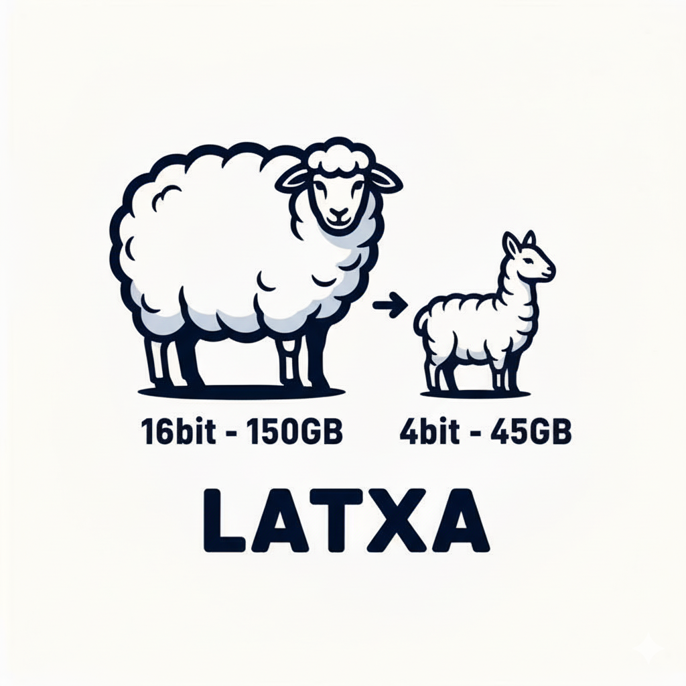

# Model Quantization

To reduce the cost of running the fact-checking workflow, we have quantized the Latxa 70B and 8B models to 4-bit with AWQ Quantization using [https://github.com/vllm-project/llm-compressor](https://github.com/vllm-project/llm-compressor). 

The quantized models ara available in this huggingface repository: https://huggingface.co/collections/Iker/latxa-4bit. They are compatible with huggingface transformers and vLLM. 

Details on how to reproduce the quantization are available at each model card. 

We found that quantization very significantly reduces VRAM requirements, while maintaining model performance. 

| Model | Accuracy | Precision | Recall | F1 Score | Undetermined Rate | Cost ($) |
|-------|----------|-----------|--------|----------|-------------------|----------|
| Latxa 8B 4-bit | 75.98% | 80.77% | 67.20% | 73.36 | 15.33% | 1.50 |
| Latxa 8B | 74.72% | 80.95% | 63.91% | 71.43 | 10.33% | 1.50 |

